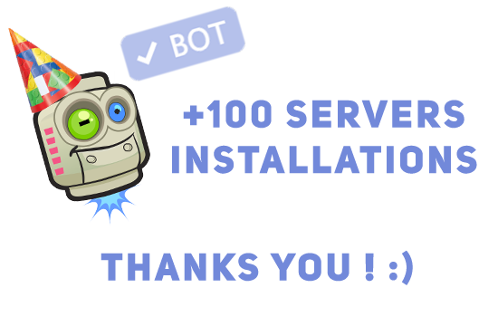
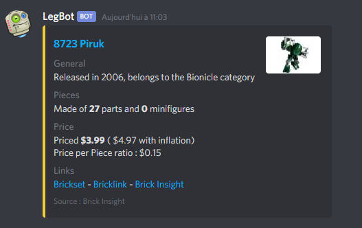
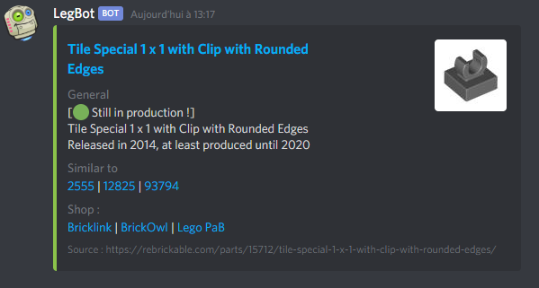

# LegBot : The LEGO Discord bot

<!-- > Yes, hybdid html markdown, sorry :( <--->

<table style="width:100%; border: none;" align="center">
<td style="width:49%; border: none;">

</td>
<td style="width:49%; border: none;">

</td>

</table>

This LEGO Discord bot is used to show general informations about LEGO sets and parts in chat.

Since July 2020, LegBot has been invited to more than 100 servers ! Thank you everyone ! I hope the bot is doing right for your queries, do not forget to contact me on twitter if something goes wrong or is missing !

## Commands :
- `!# or !set [SET NUMBER]` to have general usefull infos about a specific set

	

- `!part [PART ID]` to have informations about a piece (Bricklink id). You can add multiple pieces separated by a space (limit in config file)

	   Green for pieces still produced, orange otherwise

- `!bs [SET NUMBER]`  to show a link to Brickset about the provided set number
- `!bl [SET NUMBER]`  to show a BrickLink link to the searched set number
- `!review [SET NUMBER]`  to have infos about the requested set (rating, reviews...)
- `!help`  to display this message... Not that useful if you're reading this tho
- `!inviteLegBot`  to get an invitation link
- `!credits`  to show dev credits

## Credits :
- Rebrickable API : https://rebrickable.com/api/
- Brick Insight public API : https://brickinsights.com/
- Brickset API : https://brickset.com
- BrickLink links : https://www.bricklink
- BrickOwl links : https://www.brickowl.com

This bot is based on the [discord.js](https://discord.js.org/) library.

## Installation :
- Clone this repo
- Delete README.md and the readme.assets directory (optionnal)
- Run `npm install`
- Set your own api keys and tokens in a fresh `config.json` based on `config.example.json`
  - The `trigger` conf is the "how" you speaks to the bot. Default :  `!`
- Run `node app.js`
  - You can also use [always](https://www.npmjs.com/package/always) or [nodemon](https://nodemon.io/)
- Enjoy

	

## Support and contact
[Twitter](https://twitter.com/thibaut_plg)

## Changelog

- 1.3.0
  - The great comeback of the full `!set` command. Thanks you Brickset for the API key :)
  - Adding a config entry for the Brickset API key (`bricksetApiKey`)
- 1.2.3
  - Not a big update, I just wanted to mess around with a MixelJoints custom feature.
    - Not that crazy tho. `!mixeljoint`
  - Updating the custom functions declaration by removing the necessity to specify the directory.
- 1.2.3
  - Due to an update at the main external API, sets data has been missing for few weeks. !sets and !review are now back, but with less informations than before. I hope I'll be able to fix that soon.
  - Review are now returned with a pretty "card", like other queries.
  - Addin a debug log
  - Adding the corresponding config var (`debug`, bool)
- 1.2.2
  - You can now add custom functions without messing with existing code, simply add a js file and declare it into the config var. (See custom/example.js)
  - Adding the corresponding config var (`moreFunctions`, can be an array)
  - The bot is now adding a 🙄 reaction to a message if he didn't find the piece / set.
  - The bot is now adding a 🤔 reaction when there is no set or parts id given.
  - General code rework on message var.
- 1.2.1
  - You can now search for multiple pieces (ex : `!part 36840 36841`)
  - Adding the corresponding config var (`piecesMax`, default = 2)
- 1.2.0
  - Adding logging of commands, anonymously, to get infos about most used commands to improve them in the future.
- 1.1.0
  - Adding the !botinfo command
  - Updating the readme
  - Ordering code
- 1.0.0
  - Initial release